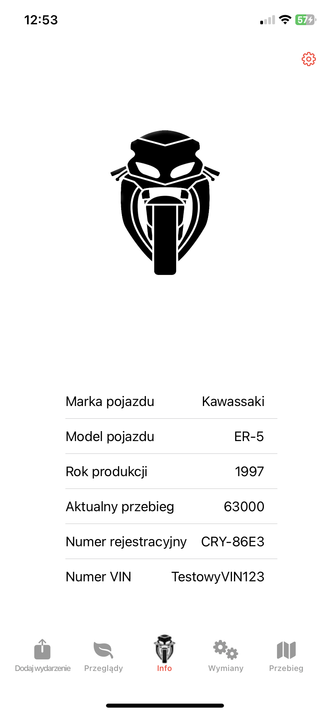

# Motorcycle Diary 
 Aplikacja powstała w ramach nauki języka SWIFT i tecnologii SWIFTUI. Jej głównym zadaniem jest pomoc w uporządkowaniu danych związanych z posiadaniem motocykla. Przypomina o zbliżających się sprawach urzędowych (takich jak przeglądy czy opłata OC) oraz zbliżających się interwałach(jak wymiana oleju silnikowego, czy serwis układu hamulcowego)
## Aplikacja składa sie z kilku podstawowtch widoków

### Tworzenie nowego pojazdu 

Ekran, który pojawia się podczas pierwszego uruchomienia aplikacji. Umożliwia podanie podstawowch danych o motocyklu 

### Ekran początkowy aplikacji 
Ekran domyslny aplikacji, wita użytkownika przy każdym włączeniu aplikacji. Możemy odczytać podstawowe dane o motocyklu - pełni formę "Dowodu rejestracyjnego"

W tym miejscu możemy ustawić czas jaki następuje pomiędzy kolejnymi interwałami.

### Widok dodawnia nowego wydarzenia
W tym mijescu uzytkownik może dodać nowe wydarzenia do hitorii swojego motocykla. Może wybierać wsród zdefiniowanych wydrzeń zdefiniowanych w dropDown liście, lub wpisać nazwę samodzielnie. Użytkownik podaje również koszt wydarzenia, przebieg przy którym nastapiło oraz date - wybieraną z małego kalendarza.

### Widok zbliżających się spraw urzędowych
W tym miejscu użytkownik widzi ile czasu pozsotało do następnego przeglądu i następnej opłaty OC

### Widok zbliżających się interwałów
W tym miejscu użytkownik widzi ile czasu pozsotało do następnej wymiany oleju i następnego seriwsu hamulcowego

### Widok wykresu przebiegu w funkcji czasu
W tym miejscu użytkownik widizi, jak zmieniał się przebieg jego motocykla w funkcji czasu 

